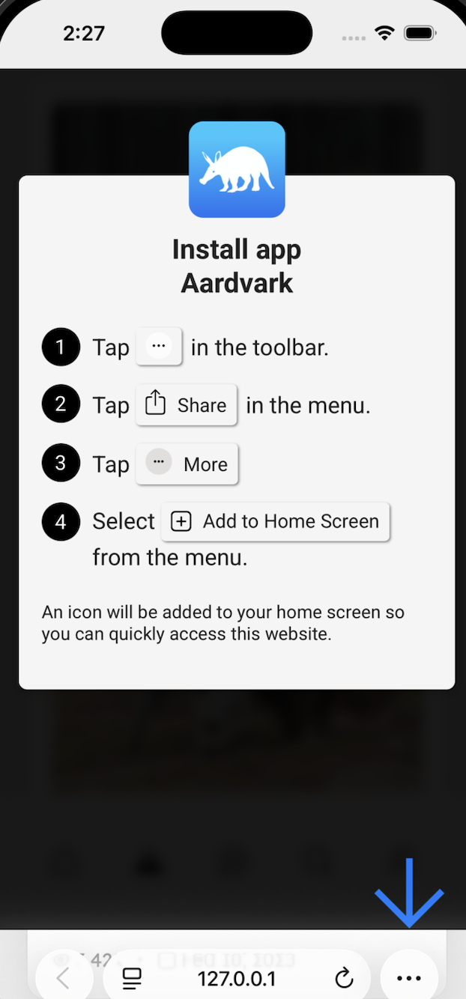
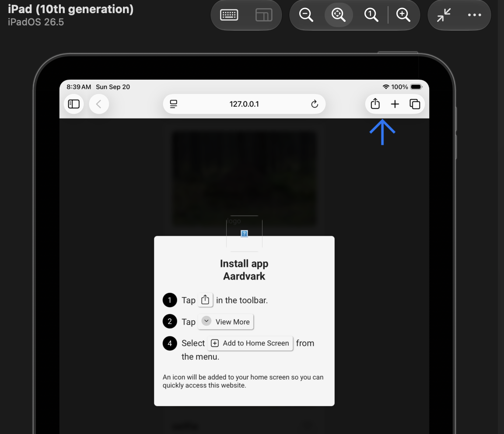
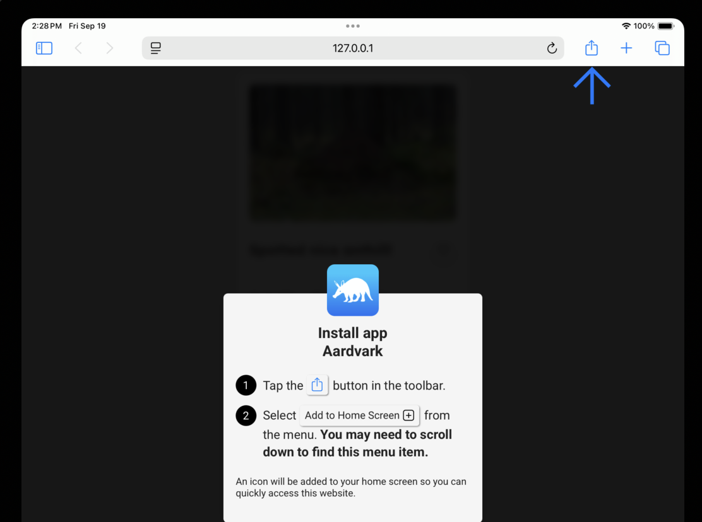

# Add-to-Homescreen 📱💻
[](https://philfung.github.io/adhs)
[](https://opensource.org/licenses/MIT)
[](https://github.com/philfung/add-to-homescreen/graphs/contributors)
[](https://github.com/philfung/add-to-homescreen/graphs/contributors)
[]()

Easily add a website to your IOS/Android/Desktop homescreen ([demo](https://philfung.github.io/adhs), [npm package](https://www.npmjs.com/package/pwa-add-to-homescreen)).


# Motivation

Add to home screen allows websites and PWA's to work like native apps without registering in the Apple or Google App Stores. Currently, it is very difficult to get users to add web apps to their home screen, limiting the utility of such websites compared to native apps. See [related Medium blog post](https://medium.com/@philipfung/add-to-homescreen-websites-an-option-for-startups-in-2023-efb92f5e03ad).

# This Library

This drop-in JS Library for websites effectively guides a user to add the website to their home screen on IOS, Android and Desktop.
</br></br>
Instructions and UI in this library have been "battle-tested" and have yielded an _~85% home screen install rate_ on IOS and Android across all ages in past implementations.

Here is a [demo (please open on your phone)](https://philfung.github.io/adhs) of library use within a hypothetical app "Aardvark" 
</br>

# Language Support

Translated to 20+ [languages](https://github.com/philfung/add-to-homescreen/tree/main/src/locales).

# Browser Support

All major browsers with > 10% market share on IOS/Android/Desktop are supported.
Here are the guides shown for each platform/browser:

#### IOS - Safari browser



#### IOS - Safari browser (IOS < 26)


#### IOS - Chrome browser


#### Android - Chrome browser


#### Android - Edge browser


#### IPad - Safari browser 



#### iPad - Safari browser (IOS < 26)



#### Desktop Windows & Mac - Chrome & Edge browsers


#### Desktop Mac - Safari browser


#### In-App Mobile Browsers

In-App browsers on popular social apps are supported.  Users are guided to open the link in the system browser, then the standard add-to-homescreen flow appears.

Apps Supported:
  * Instagram (IOS, Android)
  * Facebook (IOS, Android)
  * X / Twitter (IOS, Android - opens in system browser)

# Installation

## Prerequisite: Make your website a proper PWA (Progressive Web App)

Make sure your website meets the minimum requirements for installing a web app on homescreen for IOS and Android and Desktop.

1. At `https://your-website.com/apple-touch-icon.png`, include a square icon of your app that is (1) at least 40 x 40 pixels and (2) specifically named `apple-touch-icon.png`([example](https://github.com/philfung/add-to-homescreen/blob/main/apple-touch-icon.png)).
2. At `https://your-website.com/manifest.json`, include a web manifest file `manifest.json` ([example](https://github.com/philfung/add-to-homescreen/blob/main/manifest.json)). Reference the manifest in your index HTML file.

   `index.html`

   ```html
   <head>
     ...
     <link rel="manifest" crossorigin="use-credentials" href="manifest.json" />
     ..
   </head>
   ```

## Usage

This should be a quick drop-in library into your website.

### 1. Install the package via npm:

   ```bash
   npm install pwa-add-to-homescreen
   ```

### 2. Include the library JavaScript and CSS files in your header from the local `node_modules` directory:

   `index.html`

   ```html
   <head>
     ...
     <link
       rel="stylesheet"
       href="node_modules/pwa-add-to-homescreen/dist/add-to-homescreen.min.css"
     />
     <script src="node_modules/pwa-add-to-homescreen/dist/add-to-homescreen.min.js"></script>
     ...
   </head>
   ```

   #### Aside: Package Optimization
   The code above will include a JavaScript file containing all the available translations for the locales this library supports. It is highly optimized to be small and quick to deliver over mobile networks. If however you want to
   be even more highly optimized, the library also has JavaScript files built with just a single locale of translations, which is about 60% smaller.

   For example, the Spanish file `add-to-homescreen_es.min.js` can be included as below. If you have a dynamic server environment and know the user's preferred locale, this can be a good option. To see all the supported locales, look in the `dist` folder.

   ```html
   <head>
      <!-- This is the Spanish locale-only version of the library.  -->
     ...
     <link
       rel="stylesheet"
       href="node_modules/pwa-add-to-homescreen/dist/add-to-homescreen.min.css"
     />
     <script src="node_modules/pwa-add-to-homescreen/dist/add-to-homescreen_es.min.js"></script>
     ...
   </head>
   ```

### 3. Call the library onload.

   `index.html`

   ```javascript
   <script>
   document.addEventListener('DOMContentLoaded', function () {
    window.AddToHomeScreenInstance = window.AddToHomeScreen({
     appName: 'Aardvark',                                   // Name of the app.
                                                            // Required.
     appNameDisplay: 'standalone',                          // If set to 'standalone' (the default), the app name will be diplayed
                                                            // on it's own, beneath the "Install App" header. If set to 'inline', the
                                                            // app name will be displayed on a single line like "Install MyApp"
                                                            // Optional. Default 'standalone'
     appIconUrl: 'apple-touch-icon.png',                    // App icon link (square, at least 40 x 40 pixels).
                                                            // Required.
     assetUrl: 'node_modules/pwa-add-to-homescreen/dist/assets/img/',  // Link to directory of library image assets.

     maxModalDisplayCount: -1,                              // If set, the modal will only show this many times.
                                                            // [Optional] Default: -1 (no limit).  (Debugging: Use this.clearModalDisplayCount() to reset the count)
     displayOptions:{ showMobile: true, showDesktop: true }, // show on mobile/desktop [Optional] Default: show everywhere
     allowClose: true, // allow the user to close the modal by tapping outside of it [Optional. Default: true]
     showArrow: true, // show the bouncing arrow on the modal [Optional. Default: true] (highly recommend leaving at true as drastically affects install rates)
   });

    ret = window.AddToHomeScreenInstance.show('en');        // show "add-to-homescreen" instructions to user, or do nothing if already added to homescreen
                                                            // [optional] language.  If left blank, then language is auto-decided from (1) URL param locale='..' (e.g. /?locale=es) (2) Browser language settings
   });
   </script>
   </body>
   ```

Here's an [example implementation](https://github.com/philfung/add-to-homescreen/blob/main/index.html).

### 3-alternate. Special Case: calling the UI later
if you're calling the UI NOT onload, but sometime after (for example, in an onclick() handler for an "Install App" button), then
you should still create your the instance onload, but call your UI later on the instance variable with .show()):

`index.html`

```javascript
<script>
document.addEventListener('DOMContentLoaded', function () {

   window.AddToHomeScreenInstance = window.AddToHomeScreen({...
}));

document.getElementById('my_install_app_button').addEventListener('click', function () {
   window.AddToHomeScreenInstance.show('en');
});
</script>
</body>
```

This is because some handlers must be created onload.

# Dependencies

No dependencies. This is written in raw ES6 javascript and all css is namespaced to minimize codebase conflict and bloat.

# Contributors

- Thanks to [Shane O'Sullivan](https://github.com/shaneosullivan) for a a massive refactor to improve performance and i18n.

# License

[](https://opensource.org/licenses/MIT)
